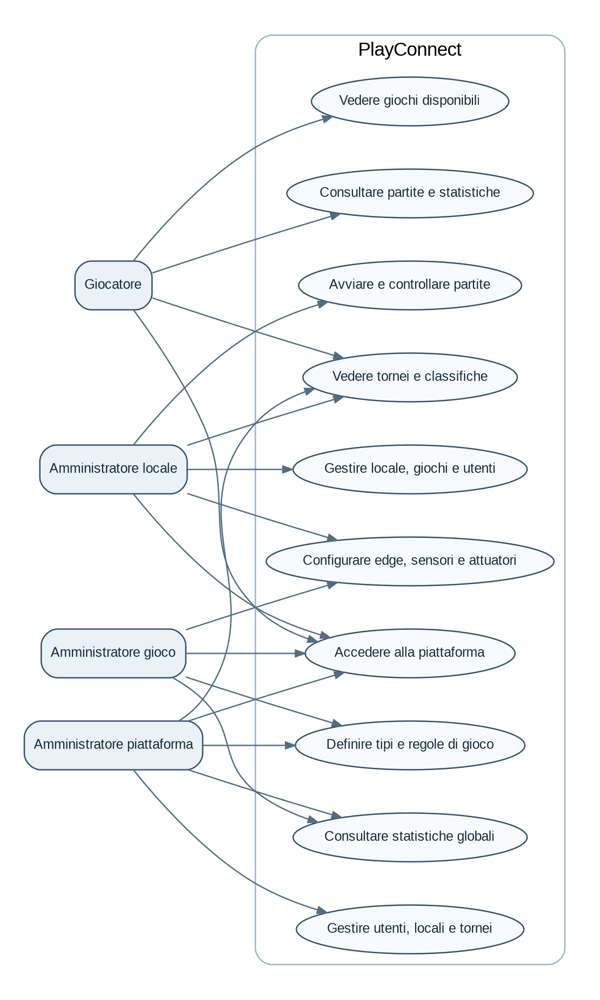
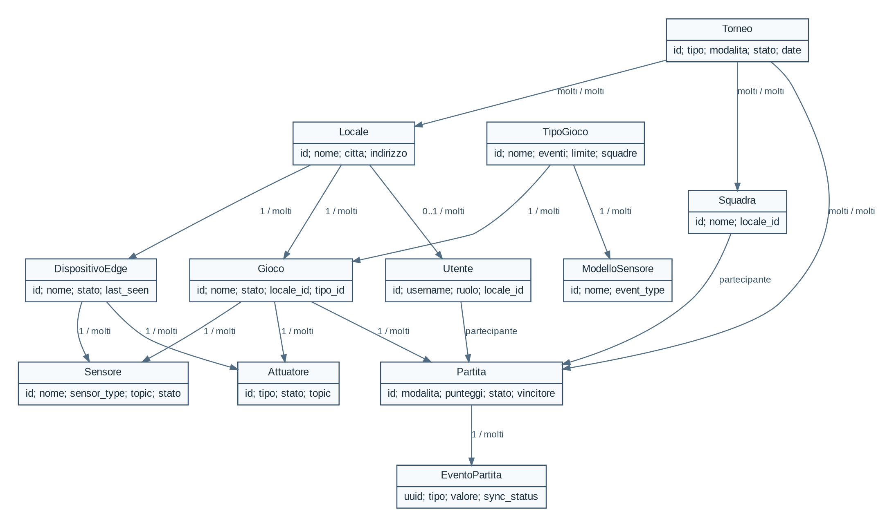

# PlayConnect - Connected Games Platform

Progetto di laboratorio PISSIR - Anno accademico 2025/2026

## 1. Introduzione

PlayConnect e una piattaforma che collega a Internet giochi tradizionali fisici. Il gioco rimane fisico, ma i sensori rilevano gli eventi importanti. Un dispositivo edge riceve gli eventi e li invia alla piattaforma centrale. Il server conserva partite, punteggi, tornei e statistiche.

Il prototipo comprende calciobalilla, freccette, bocce e Monopoli. I tipi di gioco non sono scritti direttamente nel codice: l'amministratore del gioco puo definire gli eventi e il limite di punteggio.

## 2. Specifiche funzionali

La piattaforma gestisce giocatori, amministratori locali, amministratori del gioco e amministratori della piattaforma. Le funzioni dettagliate sono descritte in `01-specifiche-funzionali.md`.

## 3. Analisi tecnologica

Per la parte centrale sono stati scelti Node.js, Express e MySQL. Il frontend usa HTML, CSS e JavaScript senza framework. La comunicazione dal browser usa REST. La comunicazione degli eventi usa MQTT perche e asincrona e permette all'edge di lavorare anche con una connessione instabile.

Docker Compose avvia tutti i componenti nello stesso modo su Windows, macOS e Linux.

## 4. Architettura

Il Catalog Service gestisce il catalogo. Il Match Service gestisce le partite e MQTT. Il Tournament Service gestisce tornei, squadre e statistiche. L'API Gateway presenta un unico indirizzo al frontend.

## 5. Dominio e database

Le entita principali sono locale, utente, tipo di gioco, gioco, dispositivo edge, sensore, attuatore, partita, evento, squadra e torneo. Le relazioni sono definite con chiavi esterne in MySQL.

## 6. API REST e MQTT

L'API pubblica e documentata in `openapi.yaml`. Gli eventi MQTT usano topic che contengono locale, gioco e partita. Il valore numerico dell'evento permette di registrare un goal oppure un tiro da 60 punti con lo stesso formato generale.

## 7. Implementazione

Quando arriva un evento, il Match Service recupera le regole del tipo di gioco. Confronta `event_type` con evento di inizio, punto partecipante 1, punto partecipante 2 ed evento di fine. Per un evento di punteggio usa il campo `value`, oppure 1 come valore predefinito.

Quando un punteggio raggiunge `score_limit`, la partita viene chiusa automaticamente. Il vincitore viene salvato, il gioco torna online, gli attuatori ricevono il comando finale e la partita puo essere collegata a un torneo attivo compatibile.

L'edge scarica la configurazione di gioco e sensori dal Catalog Service. In assenza di MQTT salva gli eventi in una coda locale. Al ritorno online li invia nello stesso ordine.

## 8. Interfaccia utente

Ogni ruolo possiede pagine dedicate. La partita live mostra punteggio, stato, ultimo evento, valore del sensore e sincronizzazione. L'interfaccia edge mostra connessione, coda offline, configurazione e comandi attuatore.

## 9. Validazione

Sono presenti test unitari, controlli di sintassi, controllo della struttura e uno script end-to-end. I dettagli sono in `06-validazione.md` e `10-risultati-test.md`.

## 10. Demo

La demo mostra prima una partita online e poi una partita avviata mentre l'edge e offline. In questo secondo caso gli eventi appaiono nella coda e vengono sincronizzati al ritorno online. La procedura completa e in `15-guida-demo-esame.md`.

## 11. Conclusione

Il progetto realizza il flusso completo dal sensore simulato alla statistica. La separazione tra REST, MQTT, edge e microservizi permette di aggiungere altri giochi senza riscrivere il sistema centrale.
