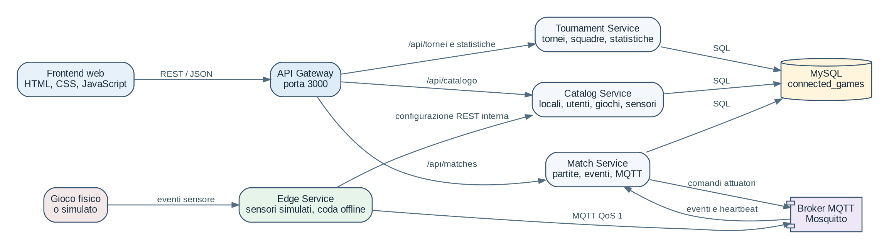
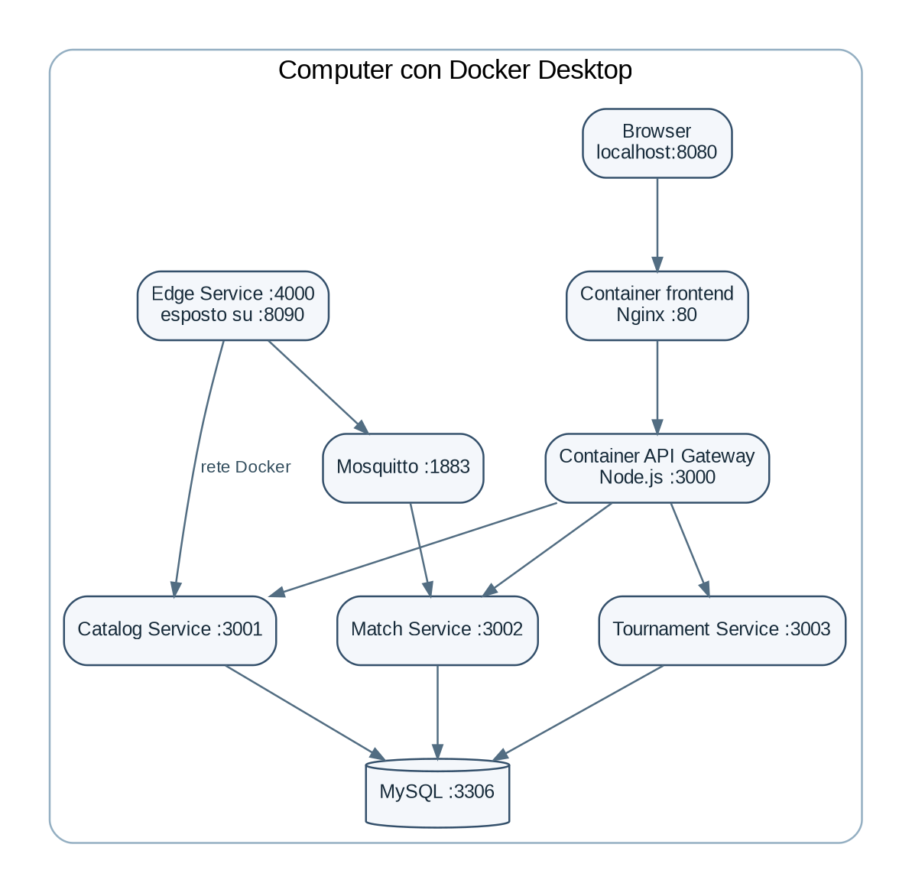

# Architettura del sistema

## Componenti

- **Frontend web**: pagine HTML, CSS e JavaScript servite da Nginx.
- **API Gateway**: riceve le richieste del browser e le inoltra al servizio corretto.
- **Catalog Service**: utenti, locali, tipi di gioco, giochi, edge, sensori e attuatori.
- **Match Service**: partite, eventi, punteggi, heartbeat MQTT e comandi agli attuatori.
- **Tournament Service**: tornei, squadre, classifiche e statistiche.
- **Edge Service**: simula i sensori, conserva gli eventi offline e li sincronizza.
- **Mosquitto**: broker MQTT.
- **MySQL**: database centrale. Solo i servizi backend accedono direttamente al database.

## Distribuzione

Ogni componente principale viene eseguito in un container. Tutti i container comunicano sulla rete creata da Docker Compose.
