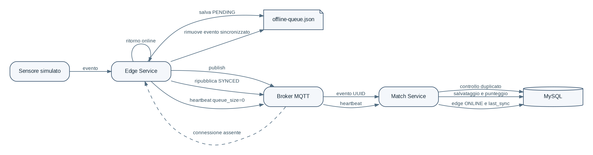

# Sincronizzazione online e offline

## Stato online

L'edge pubblica subito l'evento con `sync_status=SYNCED`. Il Match Service salva il messaggio e aggiorna il punteggio.

## Stato offline

Se MQTT non e raggiungibile oppure viene attivata la modalita offline, l'edge aggiunge l'evento a `offline-queue.json` con `sync_status=PENDING`.

## Ritorno online

L'edge ripubblica gli eventi nello stesso ordine. Il Match Service controlla l'UUID e ignora eventuali duplicati. Quando la coda e vuota, l'heartbeat aggiorna `last_sync`.
